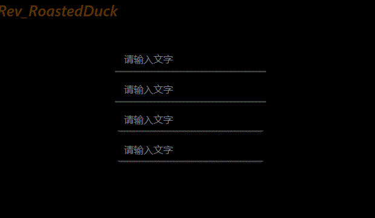
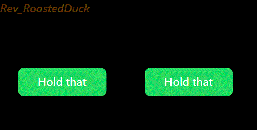

# QT-组件 QT-material-widgets
🎨 基于Qt小部件的实现😊

🎨 Qt widgets-based implementation of the Material Design specification.😊

## 内容列表
- [组件列表](#组件列表)
    - [滑动侧边栏](#滑动侧边栏)
    - [波纹按钮](#波纹按钮)
    - [流光按钮](#流光按钮)
    - [流光展示卡片](#流光展示卡片)
    - [发散按钮容器](#发散按钮容器)
    - [轮播图](#轮播图)
    - [ExpInput](#ExpInput)
    - [SimpleInput](#SimpleInput)
    - [SimpleButton](#SimpleButton)
    - [SwitchButton](#SwitchButton)
- [联系方式](#联系方式)
- [声明](#声明)

<hr/>

# 滑动侧边栏
## 效果

## 1️⃣ custom_btn.py
### 功能
- 按钮颜色动画
- 图标与文字分离
### 说明
1. 你可以在初始化的时候，为按钮添加文字和图标
2. 如果你需要修改，按钮样式，你需要到MyFrame.ui()中修改样式表。当然，你也可以在实例化之后，设置样式表
   - 注意:QFrame和QPushBUtton的背景颜色要一致，同时也要修改MyFrame._color_1的颜色
   - 当然，如果你觉得麻烦，那就别改🤣。或者写一个方法，在初始化的时候，提取样式表的颜色，然后再配置到MyFrame._color_1
3. 在MyFrame.lableAnimation(),你可以修改动按钮的变化颜色

## 2️⃣ main.py
### 功能
- 功能栏向两中间伸缩
- 伸缩后，按钮的文字会消失
- 收缩后，按钮会显示出圆角，而不是左圆右方
### 说明
- 在main.config_init(),可以修改变化后的伸缩栏宽度和按钮宽度，以达到更加美观的效果😌

<hr/>

# 波纹按钮
## 效果

## 1️⃣ 悬浮波纹按钮.py(命名好像有点问题😱
### 说明
1. ~~你可以在MyPushButton.animationConfig()配置动画参数~~
2. ~~同时，你可能还需要修改字体的大小，在MyPushButton.ui()里面~~
3. ~~此外，你甚至可以尝试把PushButton换掉，把这个样式添加到别的组件上✨~~
4. ~~在初始化时，你需要传入两个参数，一个是geometry(按钮的大小和位置)，一个是minSize(按钮的最小尺寸)~~

## 2️⃣ 悬浮波纹按钮_优化.py(正优化？负优化？反正就是优化了😊
### 说明
1. **styleSheet参数说明**📃
   - R-font-color: 配置按钮字体颜色
   - R-full-color: 配置按钮的填充颜色
2. 如果需要为按钮添加文字或者图标，可以直接调用以下方法进行配置
   - RWavyButton.setIcon(): 设置按钮图标
   - RWavyButton.setFont(): 配置字体大小
   - RWavyButton.setText(): 设置按钮文字内容
3. ~~同样的，在配置完样式后，需要调用RWavyButton.setStyleSheetConfig()来使之生效~~
### 示例
```python
    # 按钮样式配置
    btn = RWavyButton(w)
    btn.setGeometry(QRect(290, 280, 110, 35))
    btn.setStyleSheet(u"#RWavyButton{"
                       "    background-color: rgb(46, 22, 177);"
                       "	border-radius:10px;"               # 设置圆角
                       "    R-full-color:rgb(255, 89, 0);"     # 设置填充颜色
                       "    R-font-color:rgb(255, 255, 255);"  # 设置字体颜色
                      "}"
                      )

    # 设置字体
    font = QFont()
    font.setPointSize(10)
    btn.setFont(font)

    # 填写文字内容
    btn.setText(" 会变色喔")

    # 设置图标
    icon = QIcon()
    icon.addFile(u":/\u56fe\u6807/\u56fe\u6807/\u4fdd\u5b58.png", QSize(24,24), QIcon.Normal, QIcon.Off)
    btn.setIcon(icon)

    # btn.setStyleSheetConfig()
```


<hr/>

# 流光按钮
## 效果

## 1️⃣ 流光按钮.py(命名好像有点问题😓
### 说明
1. **styleSheet参数说明**📃
   - color:字体颜色
   - Rborder-width:边框大小
2. 在初始化之后，你需要设置按钮的geometry参数
3. RPushButton.createGradient()中，你可以修改流光的颜色🎊
4. 你可以在RPushButton.animationConfig()种修改定时时间，来控制流光的速度
5. ~~**在styleSheet(样式表)，你可以通过设置Rborder-width，来配置按钮边框的宽度(流光的宽度)**~~
6. ~~配置完之后，需要调用RPushButton.setStyleSheetConfig()，使配置生效❗~~
7. ~~这个代码是经过优化的，可以直接调用，直接配置样式表和geometry就可以啦~~


<hr/>


# 流光展示卡片
## 效果

## 1️⃣ 展示边框_优化.py
### 说明
1. ~~老样子，你可以在styleSheet修改样式，之后需要调用DynamicBorderFrame.setStyleSheetConfig()使样式生效~~
2. **styleSheet参数说明**📃
   - Rcolor_1:流光的颜色1
   - Rcolor_2:流光的颜色2
   - border-radius:卡片圆角大小
   - Rborder-width:卡片的边框宽度
   - background-color:外层背景颜色
   - inside-background-color:里层背景颜色

<hr/>

# 发散按钮容器
## 效果

## 1️⃣ main.py
### 说明
- 展示了发散按钮容器的使用方法✨

## 2️⃣ RButtonBox.py
### 说明
1. 参数说明📃
   - RExpandBox.locatorBoxSize: 定位组件的尺寸
   - RExpandBox.expandBoxWidgetSize: 伸缩组件的尺寸
   - RExpandBox.locatorBoxWidgetWidth: 定位按钮的宽度
   - RExpandBox.animationDuration: 每个按钮的动画的时间
   - RExpandBox.locatorBoxWidgetSpacing: 定位按钮间的间隔
   - RExpandBox.expandBoxWidgetWidth: 伸缩组件内按钮的宽度
   - RExpandBox.expandBoxWidgetSpacing: 伸缩组件内按钮的间隔
2. 方法说明
   - RExpandBox.addWidget()：添加组件
   - RExpandBox.setConfig()：使配置生效
4. ~~配置完RExpandBox后，需要调用RExpandBox.setConfig()使配置生效❗~~
5. styleShell中按钮的圆角大小需要为按钮宽度的二分之一倍❗

## 3️⃣ RGridLayout.py
### 功能
- 实现了一个简单的网格布局器
- RGridLayout的padding自适应
### 说明
1. 参数说明📃
   - RGridLayout.spacing: RGridLayout内每个小格子的间距
   - RGridLayout.grid_width: RGridLayout内每一个小格子的宽度
   - RGridLayout.grid_height: RGridLayout内每一个小格子的高度
2. 实例化 RGridLayout 的时候，需要传入布局器的尺寸
3. 通过RGridLayout.addWidget(w:QWidget,row: int,col: int)，你可以添加组件到布局器中

<hr/>

# 轮播图
## 效果

## 1️⃣ SliderNav.py
### 说明
1. 实现了一个导航栏，用于指示当前显示的图片位置
2. `changeColor_signal`用于触发`SliderNav.changeColor()`改变颜色
3. `changePixmap_signal`用于触发切换图片。目前，该功能还未开发
## 2️⃣ ClickedButton.py
### 说明
1. 实现了用于轮播图两侧切换图片的按钮

## 3️⃣ PixmapLabel.py
### 说明
1. `PixmapLabel`继承自`QLabel`,用于显示图片
2. `PixmapLabel`可以显示圆角图片，解决了图片覆盖`QLabel`圆角的问题
3. `PixmapLabel`可以使图片适应于`PixmapLabel`的尺寸，而且可以尽可能多地保留图片信息

## 4️⃣ SlideshowWidget.py
### 说明
1. 参数说明📃
   - SlideshowWidget.timer_interval: 图片展示时间
   - SlideshowWidget.animation_time: 动画过度时间
   - SlideshowWidget.lr_widget_size: 两侧图片的尺寸
   - SlideshowWidget.middel_widget_size: 中间图片的尺寸
2. `SlideshowWidget.addPixmap()`:添加待显示的图片
3. `SlideshowWidget.animation_time`和`SlideshowWidget.timer_interval`需要到`SlideshowWidget.__animationParmas()`内自行配置❗


<hr/>

# ExpInput
## 效果

## 1️⃣ ExpInput.py
### 说明
1. 参数说明📃
   - editer_height: 输入框的高度
2. 方法说明📃
   - RInput.setParams(): 配置必要的参数
   - RInput.setFontToEditer(): 配置输入框的字体样式
   - RInput.setTextToPlaceholder(): 配置提示框的字体样式
3. 在配置组件高度和输入框高度的时候，记得给提示框留下充足的显示空间❗


<hr/>


# SimpleInput
## 效果

## 1️⃣ SimpleInput.py
### 说明
1. 代码量不多，参数自行调整，如果再封装就显得很复杂了(bushi💦


<hr/>

# SimpleButton
## 效果


## 说明
1. 方法📃
   - SimpleButton_X.setParams(): 配置必要的参数
<hr/>

# SwitchButton
## 效果

## 说明
1. 方法📃
   - setParams(): 配置必要的参数
       - indicator_color:指示器的颜色
       - background_color:组件背景颜色
       - checked_indicator_color:点击后的指示器颜色
       - checked_background_color:点击后的背景颜色
<hr/>

# Slider
## 效果

## 说明📃
1. 该控件使用了不同的接口实现，分别是QPainter.drawLine()和Qpainter.drawRect()
2. 该控件的参数设置接口还未实现，但是你可以在Slider.__paramsConfig()内部修改组件参数
3. 参数列表
   - color_groove_sub:被handle滑动槽的颜色
   - color_groove_add:未被handle滑动槽的颜色
   - color_handle_inside:handle(圆形内部的颜色)
   - color_handle_outside:handle(圆形外部的颜色)
   - width_line:滑动槽的宽度
   - radius_handle:handle的半径大小


# 联系方式
- Email:2731491939@qq.com
- WeChat:Roast_71
- csdnBlog:Rev_RoastDuck

# 声明
__本内容仅供学习与交流，禁止用于任何形式的商业用途__
